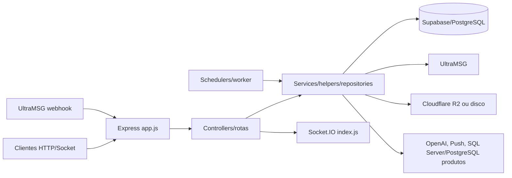

# Arquitetura do backend

> Análise: 2026-08-23 · branch `master` · commit-base `66e0771d9f61f840524cd4b0645e742df374a77a` + working tree existente.

## Visão geral

`app.js` monta segurança, parsers, webhooks, CORS, estáticos, health, rotas e erro global. `index.js` faz fail-fast de ambiente, cria HTTP/Socket.IO, autentica sockets, registra salas/eventos, inicia servidor e schedulers. Evidência: `app.js`, `index.js`, `package.json`.

## Fluxo HTTP

1. Request ID e Helmet; parsers JSON/urlencoded.
2. Webhooks são montados antes de CORS. Demais rotas passam por CORS, logger e rate limit.
3. Rotas aplicam JWT/perfil/upload e delegam a controllers; alguns módulos usam services/repositories.
4. Acesso predominante é Supabase JS com service role; produtos usam PostgreSQL separado e sincronização opcional via SQL Server.
5. Controllers respondem JSON/arquivo e podem emitir Socket.IO ou chamar serviços externos.
6. `express-async-errors` encaminha exceções ao handler global; erros 5xx são sanitizados em produção.

Todas as APIs de negócio são montadas com e sem `/api`; `/integrations/zapi` é alias legado de `/integrations/whatsapp`. Webhooks têm os aliases `/webhooks/ultramsg` e `/webhooks/whatsapp`.

## Camadas

| Camada | Responsabilidade | Evidência |
|---|---|---|
| Configuração | ambiente, Supabase, R2, uploads, bancos de produtos | `config/` |
| Rotas/middlewares | contrato HTTP, auth, perfis, limites e uploads | `routes/`, `middleware/` |
| Controllers | orquestração HTTP e parte significativa da regra legada | `controllers/` |
| Services | regras reutilizáveis, jobs, integrações, reconciliação | `services/` |
| Repositories | persistência do chat interno | `repositories/` |
| Helpers/validators | normalização, status, permissões, payloads | `helpers/`, `validators/` |
| Worker/sockets | fila de disparo e tempo real | `workers/`, `socket/`, `index.js` |
| Schema | baseline contextual, migrations e scripts de produção/precheck | `supabase/` |

Não existe unidade de transação geral entre provider e Supabase. Transações confirmadas estão em RPCs PostgreSQL (claims/locks/chat interno) e no sync de produtos (`pg`); fluxos HTTP comuns usam operações sequenciais com compensação/reconciliação.

## Assíncrono e escala

O processo principal inicia fila genérica, seis schedulers de negócio, dois de mídia inbound, mirror R2 e retenção. O worker de Disparo é processo separado (`npm run worker:disparo`). Guardas `running` evitam sobreposição somente no mesmo processo.

Socket.IO usa adapter padrão em memória; não há dependência/configuração Redis. PM2 fixa um processo em modo fork. Escala horizontal sem Redis/locks distribuídos duplicaria schedulers, fragmentaria salas/presença/rate limits/dedupe e exigiria sticky sessions. O Disparo é exceção parcial: claim `SKIP LOCKED` e advisory lock PostgreSQL suportam concorrência de workers, mas sockets de progresso continuam locais.

## Tempo real

JWT é verificado no handshake. Salas: `empresa_{company}`, `usuario_{user}`, `departamento_{id}`, `conversa_{id}` e `internal_user_{id}`. O join de conversa consulta tenant e visibilidade. Eventos e riscos estão em [07](07-SOCKET-IO-E-TEMPO-REAL.md).
