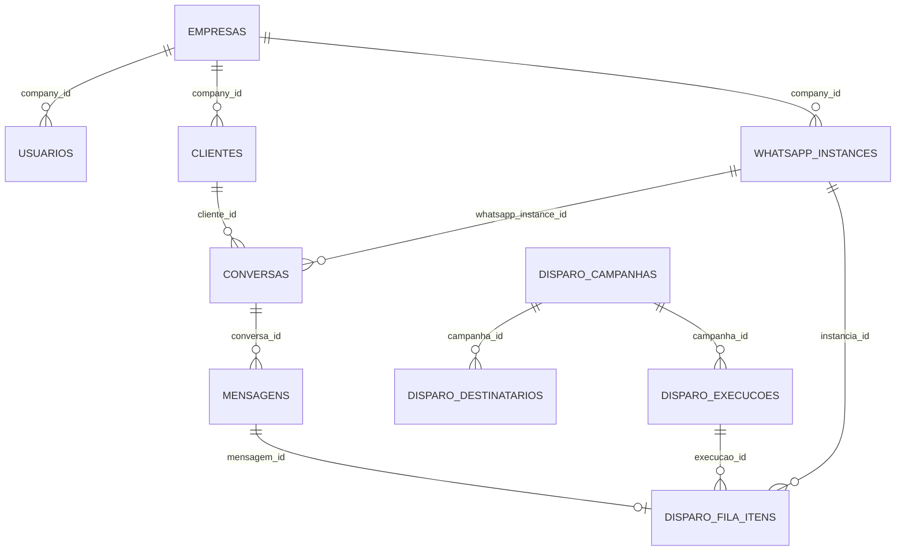

# Banco de dados

> Análise estática: 2026-08-23 · branch `master` · commit-base `66e0771d9f61f840524cd4b0645e742df374a77a`. Estado aplicado no Supabase: **PENDENTE DE VALIDAÇÃO**.

## Clientes e fonte do schema

O banco principal é PostgreSQL via Supabase JS e `SUPABASE_SERVICE_ROLE_KEY` (`config/supabase.js`). Produtos usam PostgreSQL separado (`config/produtosDb.js`) e podem receber sync transacional do SQL Server (`config/wmSqlServer.js`, `services/produtosSyncService.js`). `supabase/schema.sql` é baseline contextual desatualizado; a fonte pretendida é a sequência lexicográfica de `supabase/migrations/*.sql`.

## Entidades principais

| Grupo | Tabelas e campos importantes |
|---|---|
| Tenant/acesso | `empresas(id, ativo, configs...)`; `usuarios(id, company_id, perfil, ativo, senha_hash)`; `departamentos`; `usuario_departamentos`; `usuario_permissoes` |
| Contato | `clientes(company_id, telefone, nome, pushname, foto_perfil, nome_origem, nome_protegido)`; `cliente_nomes_vinculados` (irmãos no mesmo telefone; só importação por planilha); `tags`; `cliente_tags` |
| Atendimento | `conversas(company_id, cliente_id, telefone, whatsapp_instance_id, departamento_id, atendente_id, status_atendimento, ultima_atividade...)`; `mensagens(company_id, conversa_id, whatsapp_instance_id, whatsapp_id, client_temp_id, direcao, tipo, status, status_mensagem, url...)`; `atendimentos`; `historico_atendimentos`; `conversa_tags`; `conversa_unreads`; `conversa_usuario_prefs`; `conversa_atendentes`; `mensagens_ocultas` |
| Chatbot/SLA | `ia_config`; `regras_automaticas`; `bot_logs`; `respostas_salvas`; `avaliacoes_atendimento`; tabelas de alerta sem resposta e alerta admin |
| WhatsApp/operação | `whatsapp_instances`; legado `empresa_zapi`; `webhook_logs`; `whatsapp_envio_guard_logs`; `jobs`; `checkpoints_sync`; `sync_locks`; `configuracoes_operacionais`; `auditoria_log`; `auditoria_eventos` |
| Mídia/push | colunas `storage_*` em `mensagens`; `push_subscriptions`; `push_tokens`; `push_inbound_delivery_log` |
| Chat interno/help desk | `internal_conversations`, participantes, mensagens e reads; `helpdesk_tickets`, mensagens, transferências e notificações |
| Disparo | `disparo_campanhas`; `disparo_campanha_instancias`; `disparo_campanha_destinatarios`; `disparo_campanha_variacoes`; `disparo_campanha_limites`; `disparo_campanha_instancia_limites`; `disparo_campanha_janelas`; `disparo_campanha_revisoes`; `disparo_execucoes`; `disparo_execucao_eventos`; `disparo_pausas`; `disparo_fila_itens`; `disparo_exclusoes`; `disparo_empresa_config`; `disparo_respostas`; `disparo_optout_eventos`; `disparo_reconciliacao_decisoes`; `disparo_worker_heartbeat` |

Outras tabelas atuais declaradas pelas migrations e usadas por módulos: `departamento_grupos`, `empresa_pix_config`, `contato_opt_in`, `contato_opt_out`, `admin_atendimento_alerta_envios`, `alerta_atendimento_sem_resposta_estado`, `alerta_atendimento_sem_resposta_eventos`, `ai_cache`, `ai_logs`, `helpdesk_mensagens`, `helpdesk_transferencias`, `internal_conversation_participants`, `internal_conversation_reads`, `internal_messages` e `zapi_connect_guard`. O código também consulta `helpdesk_notificacoes`, mas não foi localizada migration que a crie: **PENDENTE DE VALIDAÇÃO**. A existência final de cada objeto no banco real permanece pendente.

Tabelas declaradas historicamente e depois removidas por migrations de agosto: `campanhas`, `campanha_envios`, `comunidades`, `grupos`, `empresas_whatsapp`, `planos`, `users` e o conjunto `crm_*` (`crm_atividades`, `crm_campaigns`, `crm_config`, `crm_google_tokens`, `crm_lead_tags`, `crm_leads`, `crm_lost_reasons`, `crm_notas`, `crm_origens`, `crm_pipelines`, `crm_stage_movements`, `crm_stages`, `crm_timeline`, `crm_webhook_logs_google`). `empresa_zapi` aparece em schema/migrations e ainda em fallbacks, mas seu estado final real deve ser confirmado.

## Relacionamentos essenciais

## Integridade, índices e concorrência

- Mensagens: índices únicos parciais por `(company_id, whatsapp_instance_id, whatsapp_id)` e variante legada sem instância; `client_temp_id` único por empresa/conversa.
- Conversas: unicidades por empresa/instância/telefone e `chat_lid`, mais índices parciais de abertas. A coexistência do índice global e do parcial torna o parcial aparentemente redundante; intenção de múltiplas conversas históricas é `NÃO CONFIRMADO`.
- Instância ativa do provider não pode pertencer a duas empresas; apenas uma default ativa por empresa; troca default ocorre em RPC com `FOR UPDATE`.
- Chatbot usa advisory lock transacional para limite de opção inválida. Chat interno usa RPCs para criação/listagem atômica.
- Disparo: idempotência por `chave_idempotencia`; claim via `FOR UPDATE SKIP LOCKED`; advisory lock por instância; revisão única por campanha/versão. A Etapa 9 adiciona execução ativa única e recuperação segura de lease, mas não está commitada/aplicação não confirmada.
- Constraints de `status_atendimento` evoluem até incluir `aberta`, `em_atendimento`, `fechada`, `aguardando_cliente`, `mensagem_disparada`, `pagamento_pendente`, `em_atraso`; confirmar migration aplicada antes de gravar estados novos.

## RLS e multitenancy

`20260630120000_rls_company_id_hardening.sql` torna centrais `company_id NOT NULL`, remove default perigoso e cria policies baseadas em `current_setting('app.company_id')`; a migration seguinte remove defaults restantes. Tabelas novas de Disparo ligam RLS, revogam `anon/authenticated` e concedem `service_role`, sem policy de leitura direta.

Como o backend usa service role, RLS é ignorado: toda leitura/update/delete precisa de filtro tenant e todo insert precisa fornecer `company_id`. FKs simples não garantem que entidades relacionadas sejam da mesma empresa; a aplicação precisa validar.

## Ordem segura

Aplicar migrations por nome, depois de backup e prechecks. Para índices grandes, comparar a migration normal com `supabase/production/*_concurrently.sql`; não aplicar ambas cegamente. Migrations destrutivas de agosto removem CRM/campanhas legadas/planos/tabelas auxiliares e exigem confirmação do estado. Nunca executar `supabase/scripts_manuais/perigosos/` automaticamente.

### Migration mais recente (2026-08-27)

`20260827130000_clientes_nome_protegido.sql` — adiciona `clientes.nome_origem`, `clientes.nome_protegido` e `clientes.nome_override`, com trigger que impede webhooks/sync de alterar nome protegido. **Não aplicar automaticamente**; exigir autorização antes do deploy.

`20260823230000_chat_search_word_prefix.sql` — **sem novas tabelas**. Adiciona:
- Extensões `unaccent` e `pg_trgm` (se não existirem)
- Função `search_name_key(text)` que normaliza texto em chave de busca (remove acentos, pontuação vira separador)
- Índice funcional em `clientes(nome)` usando a função, permitindo busca por prefixo de palavra em vez de `LIKE %termo%` (que casava no meio de palavras)
- Objetivo: "hu" não casava mais em "Shuarts" — só no início de palavra ou nome
