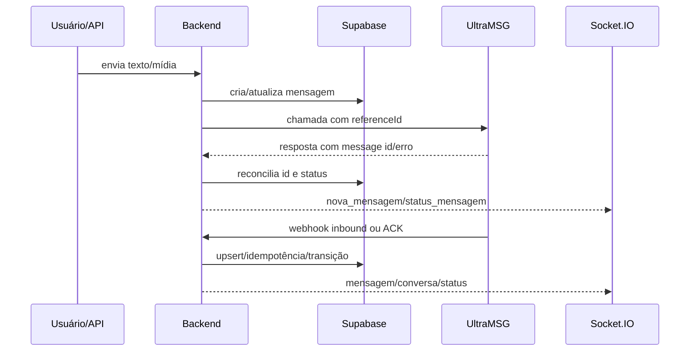

# WhatsApp, UltraMSG e webhooks

> Análise estática: 2026-08-23 · `master` · `66e0771d9f61f840524cd4b0645e742df374a77a` · fontes principais: **`services/providers/ultramsg.js`** (shim; pasta `ultramsg/`; **não** existe `ultramsgProvider.js`), `services/whatsappInstanceService.js`, `controllers/webhookUltramsgController.js`, `controllers/webhookZapiController.js`, `controllers/chatController.js` + `controllers/chat/` ([23](23-CHAT-CONTROLLER-MODULARIZACAO.md)), `middleware/requireWebhookToken.js`, `middleware/resolveWebhookInstance.js` e testes `*Ultramsg*`, `*Webhook*`, `*Ack*`.
>
> Mapa interno do adapter (envio, JID, HTTP, pastas): [21](21-ULTRAMSG-PROVIDER-MODULARIZACAO.md). Este doc 06 cobre o fluxo ponta a ponta (chat → provider → webhook).

## Modelo da integração

UltraMSG é o provider efetivamente instanciado. Cada registro ativo de `whatsapp_instances` associa uma empresa a `instance_id` e token, com uma instância default. `whatsappInstanceService` resolve credenciais; respostas HTTP e logs devem usar versões sanitizadas. Rotas sob `/integrations/whatsapp` (e alias legado `/integrations/zapi`) consultam status, QR code, reiniciam, sincronizam e configuram callbacks.

## Envio

- Texto, arquivo, contato, localização, reação, ligação, encaminhamento e PIX saem de `chatController.js` e de `controllers/chat/` (mapa: [23](23-CHAT-CONTROLLER-MODULARIZACAO.md)); o provider escolhe o endpoint UltraMSG conforme o tipo.
- A mensagem local guarda direção, conteúdo/tipo, conversa, tenant, instância, identificadores externos e status. Mídia pode passar por disco/R2 antes ou depois da chamada conforme o fluxo.
- Envios manuais usam `referenceId` no formato `crm-<id da mensagem>`; itens do worker de campanha usam `disp-<id do item da fila>`. O prefixo identifica a origem na reconciliação.
- `client_temp_id` tem dedupe local de 30 segundos e índice único no banco. O cache em memória só reduz duplo clique no mesmo processo; o índice é a garantia persistente.
- Não existe transação distribuída entre PostgreSQL e UltraMSG. Se a chamada externa ocorrer e a persistência falhar, o resultado pode ficar incerto; não reenviar cegamente.

## Recebimento e resolução do tenant

`POST /webhooks/ultramsg` e `/webhooks/whatsapp` passam por rate limit, token compartilhado e resolução da instância. O token pode vir em header, Bearer ou query; a comparação é timing-safe. Em produção, fallback sem `instanceId` fica desligado por padrão; fora de produção seu default é permissivo. A instância determina `company_id` — payload não pode escolher o tenant.

`webhookUltramsgController` normaliza formatos UltraMSG e delega a lógica histórica de domínio a `webhookZapiController`. O fluxo:

1. identifica tipo/inbound/ACK e instância;
2. normaliza telefone, participante de grupo, ids, conteúdo e mídia;
3. deduplica/localiza contato, conversa e mensagem pelo tenant/instância/ids;
4. persiste a mensagem e atualiza conversa, não lidos e atendimento/triagem;
5. agenda alguns efeitos laterais com `setImmediate` e emite sockets/push;
6. responde HTTP.

Inbound não tratado com sucesso retorna `500`, permitindo tentativa do provider; ACK com falha interna é capturado e responde `200` para evitar tempestade de retry. A idempotência deve tornar novas entregas seguras, mas os cenários reais do provider são **PENDENTE DE VALIDAÇÃO**.

## ACKs e estados

Mapeamento confirmado de ACK UltraMSG: `pending → pending`, `server → sent`, `device → delivered`, `read → read`, `played → played`. O helper canônico aceita `pending`, `sending`, `sent`, `delivered`, `read`, `played`, `erro` e `failed`; aliases em português/legados são normalizados nos pontos de entrada. Um ranking impede regressão por ACK fora de ordem. Em grupos, `read/played` são limitados a `delivered` porque o ACK não representa leitura por todos.

O reconciliador usa id externo, `referenceId` e dados de instância para localizar a mensagem. A identidade deve sempre considerar empresa e, quando disponível, `whatsapp_instance_id`. O banco contém constraints/índices de idempotência; linhas legadas com instância nula exigem compatibilidade.

## Mídia

Inbound usa `inboundMediaPersistenceService`: URL somente HTTPS, host/caminho permitido, limite e redirects revalidados; baixa e persiste localmente/R2 conforme rollout. Outbound valida tipo/extensão/tamanho antes do provider. A rota proxy não deve virar fetch genérico; detalhes em [08](08-AUTENTICACAO-SEGURANCA-E-MULTITENANCY.md).

## Campanhas, resposta e opt-out

O worker monta `referenceId disp-*`, registra provider id e datas na fila. **Enviada** = o provedor aceitou (ou dry-run). **Entregue/lida** só avançam com ACK (`device`/`read`). O ACK da UltraMSG quase nunca ecoa `referenceId` e em geral traz o **wamid** (`true_5534…@c.us_SID`), enquanto o `POST /messages/chat` devolve id **numérico de fila**. O disparo grava esse número em `provider_queue_id` (como o chat), não em `whatsapp_id`. O fallback global de ACK só aplicava se existisse **1** outbound pendente na empresa — na campanha o 1º contato ia a entregue e os demais ficavam em enviada. Há fallback por **telefone extraído do wamid** (uma conversa). Recibos já no chat são copiados para a fila em `sincronizarFilaComAckDoChat`. Mensagem inbound pode ser classificada como resposta à campanha; palavras normalizadas de descadastro geram opt-out e impedem futuros envios. Itens com lease vencido em `enviando` passam a `incerta` na Etapa 9 (código **no Git**; aplicação no banco = `PENDENTE DE VALIDAÇÃO`); se já têm `provider_message_id` ou `enviado_em`, o worker não reenvia. Decisão manual e reconciliação ficam nas rotas da Etapa 8. Dry-run (`DISPARO_DRY_RUN` default true / live off) nunca chama UltraMSG — a fila fica em enviada e **não chega no WhatsApp**.

## Falhas, reenvio e observabilidade

- Erro conhecido antes de qualquer aceitação do provider pode marcar falha e aplicar backoff.
- Resultado ambíguo deve permanecer incerto/reconciliável; reenvio manual exige verificar provider id/data.
- Webhook logger guarda resumo por padrão; payload completo depende de configuração e aumenta risco de PII.
- Logs não devem incluir tokens, headers de autenticação, URLs assinadas ou corpo completo de clientes.
- A disponibilidade/semântica exata da UltraMSG, entrega de mídia, callbacks duplicados e janela de retry são **PENDENTE DE VALIDAÇÃO em ambiente controlado**. O código não implementa nem presume HMAC da UltraMSG; a proteção confirmada é token compartilhado + instância.

## Invariantes

1. Resolver tenant pela instância confiável, não pelo body.
2. Persistir ids externos e `referenceId`; não descartar estado incerto.
3. Nunca regredir status por ACK atrasado.
4. Não emitir mensagem para outro tenant; incluir instância na identidade.
5. Não testar envio/restart/configuração de webhook contra instância real sem autorização explícita.
6. Foto de perfil: consultar com o JID real (`profilePictureChatIdCandidates`), nunca `phoneToChatId`/`toZapiSendFormat`. Não gravar `payload.photo` de mensagem como avatar.
7. HTTP 200 com `{ error }` ou `sent=false` não é sucesso (`normalizeUltraMsgSendResult`). Retry de POST de mensagem só em falha de conexão; upload de mídia pode retentar.

